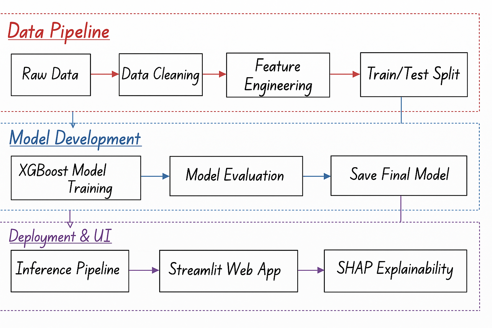

# 📊 Credit Card Default Prediction System  
### Machine Learning + Explainability + Streamlit App

This project predicts whether a credit card customer will default next month using a Machine Learning model (XGBoost) with SHAP-based explainability.  
It includes a full end-to-end pipeline from raw data → feature engineering → model training → inference → Streamlit UI.

---

# ▶️ How to Run the App

## 1️⃣ Install dependencies
```
pip install -r requirements.txt
```

## 2️⃣ Start the Streamlit app
```
cd app
python -m streamlit run app/app.py
```

The app will automatically open in your browser.

---

# 🧠 What This Project Does

- Predicts the **probability of credit card default**  
- Shows **risk level** (Low / Medium / High)  
- Provides **SHAP explainability** for each prediction  
- Displays global feature importance  
- Includes advanced **feature engineering pipeline**  
- Clean and responsive **Streamlit interface**  
- Modular `src/` Python scripts for production-level usage  

---

## 🔧 Architecture Overview




---
# 🚀 Technologies Used

- Python  
- Pandas & NumPy  
- XGBoost  
- Scikit-learn  
- SHAP  
- Streamlit  

---

# 📁 Project Structure

```
credit-card-risk-analysis/
│
├── image/
│   ├── architecture.png
├── data/
│   ├── raw/
│   └── processed/
│
├── notebooks/
│   ├── 01_eda.ipynb
│   ├── 02_feature_engineering.ipynb
│   ├── 03_model_baseline.ipynb
│   ├── 04_model_advanced.ipynb
│   └── 05_model_explainability.ipynb
│
├── models/
│   └── final_xgb_model.json
│
├── src/
│   ├── data_prep.py
│   ├── feature_engineering.py
│   ├── inference.py
│
├── app/
│   └── app.py
│
└── README.md
```

---

# 📘 Dataset

Source: **UCI Machine Learning Repository**  
Dataset: **Default of Credit Card Clients**

Target column:  
`default payment next month` (0 = No Default, 1 = Default)

---

# 🧠 Feature Engineering (Short Summary)

Key engineered features include:

### ✔ Payment Delay Features  
- avg_delay  
- max_delay  
- delay_count  

### ✔ Bill & Payment Patterns  
- total_bill_6m  
- total_pay_6m  
- bill_growth  
- pay_amt_growth  

### ✔ Financial Ratios  
- utilization_ratio  
- repayment_ratio  

These features help capture customer behavior more accurately.

---

#  Model (XGBoost)

Best hyperparameters used:

```json
{
  "n_estimators": 450,
  "max_depth": 5,
  "learning_rate": 0.07,
  "min_child_weight": 1,
  "subsample": 0.8,
  "colsample_bytree": 0.8,
  "gamma": 0.1
}
```

### Model Performance  
- Accuracy: ~0.77  
- F1 Score: ~0.54  
- AUC: ~0.78  

---

# 🧩 Inference Pipeline

The `src/inference.py` module includes:

- Model loading  
- Data preprocessing  
- Feature engineering  
- Prediction  
- SHAP explanation  

This makes the system ready for deployment in production.

---

# ⭐ Author

**Vishal Sahu**  
Machine Learning Enthusiast  

---

⭐ If you like this project, please give it a star on GitHub!
